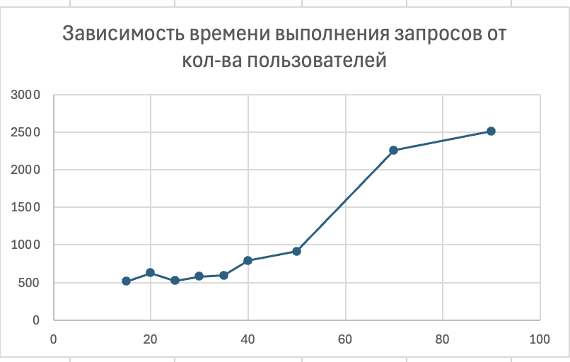

# Лабораторная работа №4
## Нагрузочное и стресс-тестирование веб-приложения
## Выполнила Старостина Елена, P3319, ИСУ 414257

## Требования
- 10 пользователей
- 40 rpm от каждого пользователя
- Максимальное время обработки - 600мс 

## Описание конфигурации JMeter:
### Нагрузочное тестирование:
В каждой Thred Group задан HTTP Request с url из задания, Duration Assertion на 600 мс и Constant Throughput Timer на 40 samples per minute. Каждая Thread group отправляет 10 пользователей с 40 loop count, также указан ramp-up период 60 секунд для более равномерного распределения нагрузки. 

## Сводные результаты тестирования

| Конфигурация | Среднее время, мс | Минимальное время, мс | Максимальное время, мс | Недопустимое время, % |
| :--- | :---: | ---: | ---: | ---: |
| 1 | 1197 | 1109 | 1305 | 100 |
| 2 | 899 | 731 | 1113 | 100 |
| 3 | 508 | 313 | 725 | 11.75 |

## Стресс-тестирование
Проводится на конфигурации №3, так как только она показала удовлетворительные результаты при нагрузочном тестировании. Для стресс тестирования добавим assert соблюдения статуса ответа 200 (чтобы быстрые ошибочные ответы не сбивали картину)

## Результаты стресс-теста 
По результатам теста видно, что после 35 пользователей среднее время ответа превышает требуемые 600мс. Уже на 30 пользователях процент запросов, выполнявшихся дольше требуемого, достиг 30. Дальше время ответа продолжает расти, до тех пор пока не достигает среднего в 2255мс при 70 пользователях (95% запросов выполнялись дольше 600мс). Видно, что запросы, пришедшие в середине выполнения, выполняются дольше всего.

При 180 пользователях появляются первые 500, однако они составляют всего 5% от общего числа запросов. При уменьшении ramp-up периода до 1с и увеличении кол-ва пользователей до 200, кол-во неуспешных запросов увеличивается до 14%. При дальнейшем увеличении нагрузки кол-вол 500 не превышает 25% - система хорошо держит нагрузку 

## Выводы
По результатам нагрузочного тестирования видно, что удовлетворительный результат показывает только конфигурация №3 (самая дорогая) - конфигурации №1 и №2 выполняют запросы дольше требуемого 

